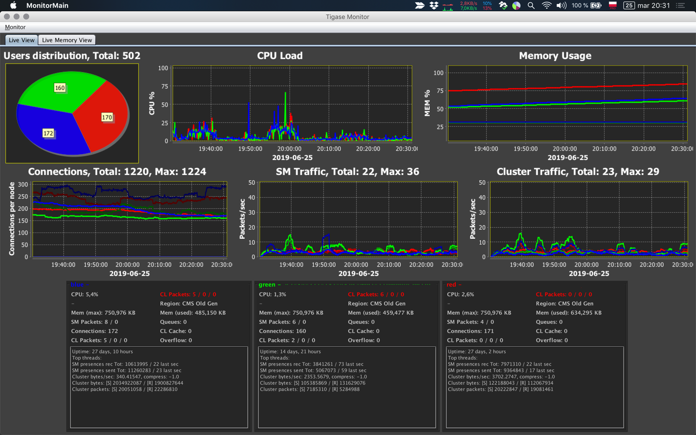

 /statusIcon)


# Tigase Server Management Console (Monitor)

Stand-alone application for the Tigase XMPP Server monitoring and management console.

# Features

* Data retrieval and visualisation over JMX protocol
* Custom panels
* Detailed memory monitoring

# Support

When looking for support, please first search for answers to your question in the available online channels:

* Our online documentation: [Tigase Docs](https://docs.tigase.net/)
* Our online forums: [Tigase Forums](https://help.tigase.net/portal/community)
* Our online Knowledge Base [Tigase KB](https://help.tigase.net/portal/kb)

If you didn't find an answer in the resources above, feel free to submit your question to either our 
[community portal](https://help.tigase.net/portal/community) or open a [support ticket](https://help.tigase.net/portal/newticket).

# Downloads

Binaries can be downloaded from our [Maven repository](https://maven-repo.tigase.net/#artifact/tigase/tigase-monitor/)

# Compilation 

It's a Maven project therefore after cloning the repository you can easily build it with:

```bash
mvn -Pdist clean install
```

# License

 Official <a href="https://tigase.net/">Tigase</a> repository is available at: https://github.com/tigase/tigase-monitor/.

Copyright (c) 2004 Tigase, Inc.

Licensed under AGPL License Version 3. Other licensing options available upon request.
